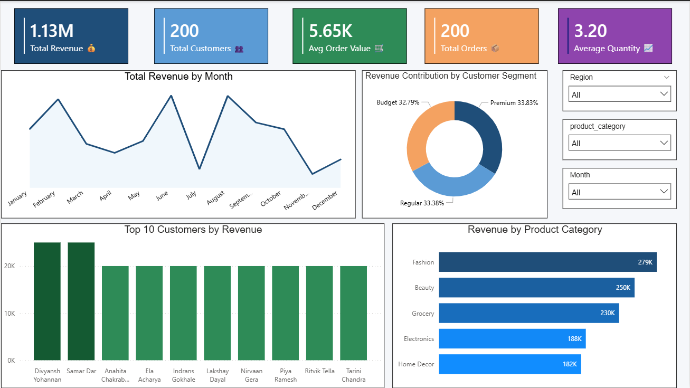

# Customer Purchase Pattern Analyzer

## Project Overview

The Customer Purchase Pattern Analyzer is an end-to-end Data Analytics and Business Intelligence project designed to analyze customer purchasing behavior in a retail environment.

The project uses PostgreSQL, SQL, Excel, and Power BI to identify customer segments, revenue trends, product performance, and high-value customers that can support business decision-making.

---

## Business Problem

Retail companies collect large volumes of customer transaction data but often struggle to convert it into actionable insights.

This project helps answer key business questions such as:

- Which product categories generate the highest revenue?
- Which customer segments contribute the most revenue?
- Who are the highest-value customers?
- How does revenue change over time?
- What customer purchasing patterns can improve business performance?

---

## Project Objectives

- Analyze customer purchasing behavior.
- Identify revenue-driving product categories.
- Perform customer segmentation analysis.
- Measure key business KPIs.
- Develop an interactive Power BI dashboard.
- Generate actionable business insights.

---

## Dataset Information

The dataset contains 200 customer purchase transactions and includes:

### Customer Information
- Customer ID
- Customer Name
- Age
- Gender
- City
- Region
- Occupation

### Product Information
- Product Category
- Product Name
- Quantity Purchased
- Unit Price

### Purchase Information
- Purchase Date
- Last Purchase Date
- Purchase Frequency
- Payment Method
- Purchase Channel

### Customer Details
- Customer Segment
- Loyalty Status
- Discount Used

---

## Tools & Technologies

- PostgreSQL
- SQL
- Power BI
- Excel

---

## Project Workflow

1. Data Collection
2. Data Cleaning
3. PostgreSQL Database Creation
4. SQL Analysis
5. KPI Development
6. Power BI Dashboard Creation
7. Business Insight Generation
8. Reporting & Documentation

---

## Key Performance Indicators (KPIs)

| KPI | Value |
|------|--------|
| Total Revenue | ₹1.13M+ |
| Total Customers | 200 |
| Average Order Value | ₹5.65K |
| Total Orders | 200 |
| Average Quantity Purchased | 3.20 |

---

## Dashboard Visualizations

### Revenue Trend Analysis
Monthly revenue performance over time.

### Product Category Analysis
Revenue generated by different product categories.

### Customer Segment Analysis
Revenue contribution by Premium, Regular, and Budget customers.

### Top Customer Analysis
Identification of highest-value customers.

---

## Key Insights

### Fashion Category Generated Highest Revenue
Fashion products generated approximately ₹279K in revenue, making it the highest-performing category.

### Premium Customers Contributed Most Revenue
Premium customers generated approximately ₹382K in revenue.

### Strong Business Performance
The business generated more than ₹1.13 million in revenue from 200 customer transactions.

### High-Value Customers Identified
Top customers generated approximately ₹25K individually.

### Balanced Customer Segmentation
Revenue contribution was evenly distributed across customer segments.

---

## Business Recommendations

- Focus marketing efforts on Fashion products.
- Strengthen loyalty programs for Premium customers.
- Reward high-value customers with personalized offers.
- Improve sales performance of lower-performing categories.
- Leverage customer segmentation for targeted campaigns.

---

## Repository Contents

### Dataset
- customer_purchase_pattern_analyzer_200_records.csv

### SQL Files
- create_table.sql
- analysis_queries.sql

### Power BI Dashboard
- Customer Purchase Pattern Analyzer.pbix

### Documentation
- Project Report
- Dashboard Screenshot

---

## Conclusion

This project demonstrates how customer transaction data can be transformed into meaningful business insights using SQL and Power BI. The analysis helps businesses understand customer behavior, improve decision-making, and optimize revenue growth strategies.

---

## Author

**Rohan Patel**

Aspiring Data Analyst | SQL | PostgreSQL | Power BI | Business Intelligence
